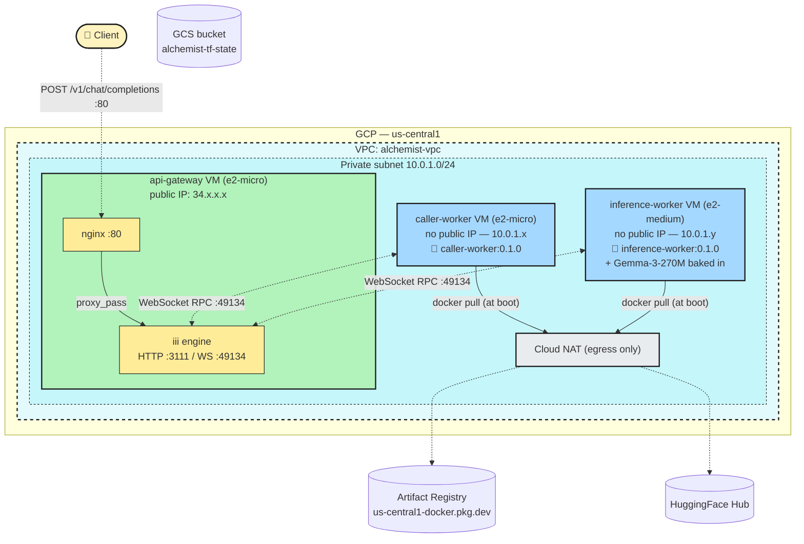
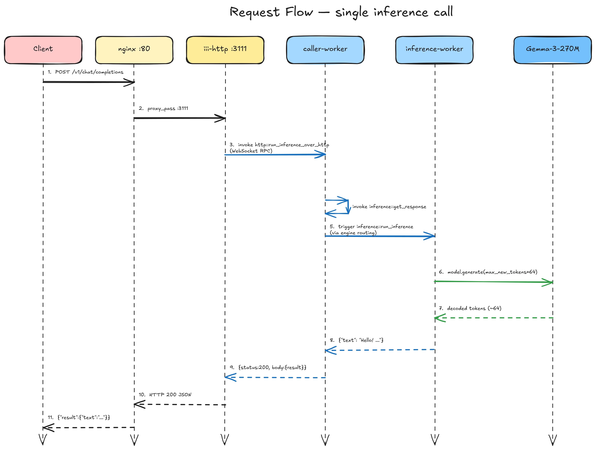
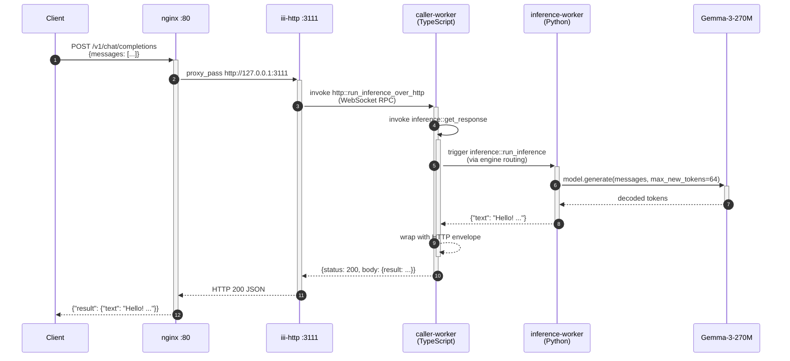
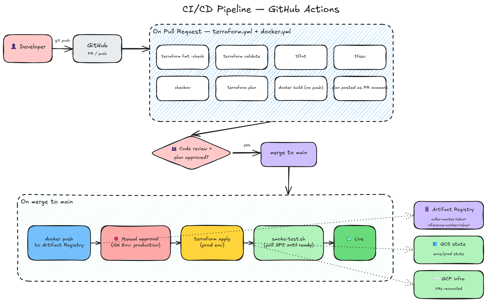
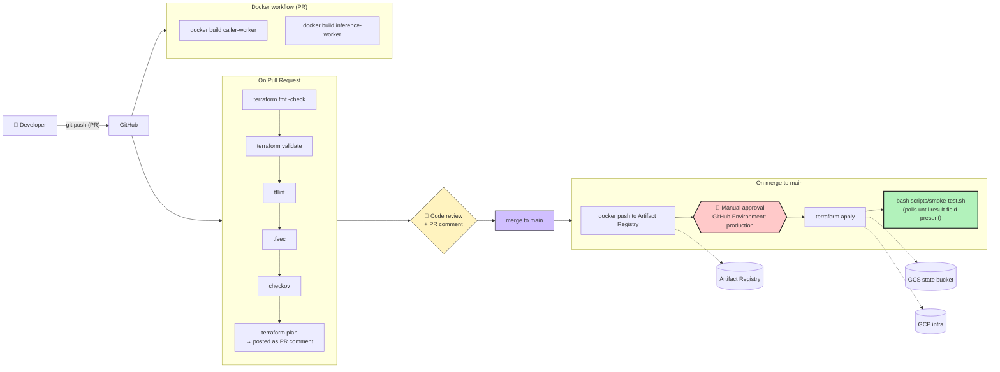
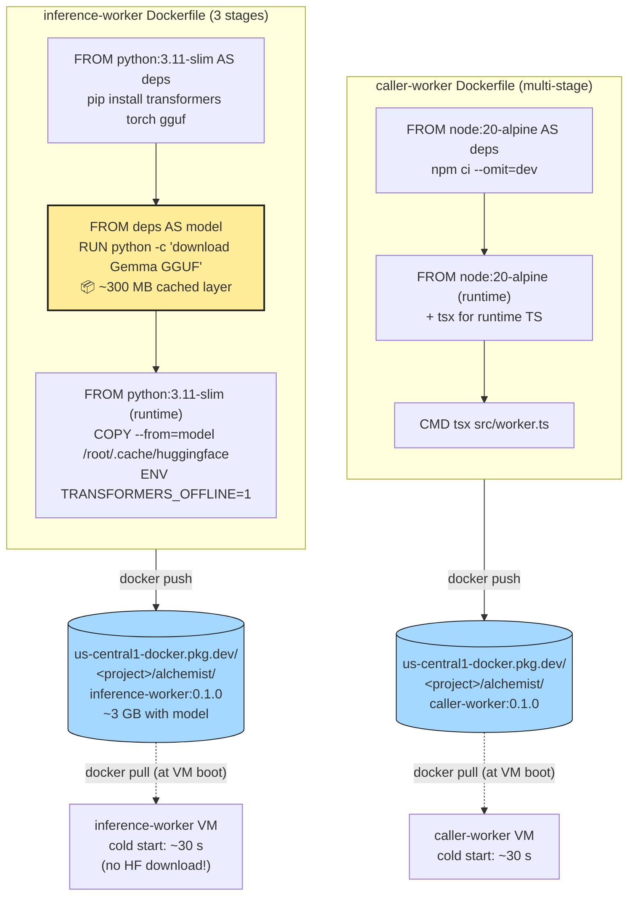
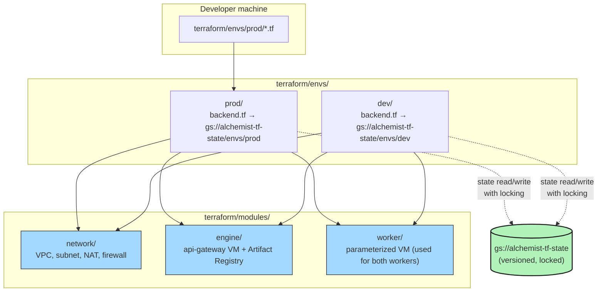

# Distributed Inference Stack — DevOps Assignment

Deploys the [`quickstart`](../quickstart) project across three GCP VMs inside a private subnet, wires the workers together via the iii RPC engine, and exposes model inference through a public JSON HTTP API.

---

## Architecture


> Editable source: [`diagrams/architecture.excalidraw`](diagrams/architecture.excalidraw) — open with [excalidraw.com](https://excalidraw.com)



---

### Request Flow



> Editable source: [`diagrams/request-flow.excalidraw`](diagrams/request-flow.excalidraw)



---

### CI/CD Pipeline



> Editable source: [`diagrams/cicd-pipeline.excalidraw`](diagrams/cicd-pipeline.excalidraw)



---

### Docker Image Build Strategy



---

### Terraform State & Module Layout



---

## Repository Layout

```
submission/
├── .github/workflows/
│   ├── docker.yml          # Build & push images on push to main
│   └── terraform.yml       # Lint/validate/plan on PR; apply on merge
├── docker/
│   ├── caller-worker/      # Multi-stage Node/TypeScript image
│   │   ├── Dockerfile
│   │   ├── package.json
│   │   ├── tsconfig.json
│   │   └── src/worker.ts
│   └── inference-worker/   # Python + Gemma-3-270M baked in
│       ├── Dockerfile
│       ├── requirements.txt
│       └── inference_worker.py
├── terraform/
│   ├── modules/
│   │   ├── network/        # VPC, subnet, Cloud NAT, firewall rules
│   │   ├── engine/         # api-gateway VM + Artifact Registry repo
│   │   └── worker/         # Generic parameterized worker VM
│   └── envs/
│       ├── prod/           # Production (GCS state: envs/prod)
│       └── dev/            # Development (GCS state: envs/dev)
├── scripts/
│   ├── startup-engine.sh   # api-gateway: installs iii binary + nginx
│   ├── startup-worker.sh   # worker VMs: installs Docker, pulls & runs image
│   ├── build-and-push.sh   # local: builds images and pushes to Artifact Registry
│   └── smoke-test.sh       # post-deploy health check (polls API, asserts result)
├── systemd/                # Reference systemd units
├── config/
│   └── engine-config.yaml  # iii engine config (distributed mode)
└── README.md
```

---

## API Reference

### `POST /v1/chat/completions`

**Request body**

```json
{
  "messages": [
    { "role": "system", "content": "You are a helpful assistant." },
    { "role": "user",   "content": "Say hello." }
  ]
}
```

**Response**

```json
{
  "result": {
    "text": "Hello! How can I help you today?"
  }
}
```

**Verified live curl command**

```bash
# Replace <PUBLIC_IP> with: terraform -chdir=terraform/envs/prod output api_gateway_public_ip
curl -s -X POST http://<PUBLIC_IP>/v1/chat/completions \
  -H "Content-Type: application/json" \
  -d '{"messages":[{"role":"user","content":"Say hello in one sentence."}]}' | jq .
```

**Live output captured from deployed stack:**

```json
{"result":{"text":"Say hello in one sentence.\nHello! I am here to help you."}}
```

---

## Redeploy from Scratch

### Prerequisites

```bash
# 1. gcloud CLI + auth
gcloud auth login
gcloud auth application-default login

# 2. Terraform >= 1.5
terraform version

# 3. Docker (for building images)
docker version

# 4. Enable required GCP APIs
gcloud services enable compute.googleapis.com artifactregistry.googleapis.com --project=<your-project>

# 5. Create the GCS state bucket (one-time, not managed by Terraform to avoid chicken-egg)
gcloud storage buckets create gs://alchemist-tf-state --location=us-central1 --project=<your-project>
gcloud storage buckets update gs://alchemist-tf-state --versioning
```

### Step 1 — Build and push Docker images

```bash
# Build inference-worker (~3–4 GB image — includes model weights)
# Build caller-worker (~250 MB image)
bash scripts/build-and-push.sh <your-project-id> 0.1.0
```

> The inference-worker image bakes the Gemma-3-270M GGUF weights into the image
> at build time. This means VM cold-start is ~30 s (docker pull from Artifact
> Registry, same GCP region) instead of 10–15 min (live download from HuggingFace).

### Step 2 — Configure Terraform

```bash
cd terraform/envs/prod
cp terraform.tfvars.example terraform.tfvars
# Edit terraform.tfvars — set project_id and image_tag=0.1.0
```

### Step 3 — Provision infrastructure

```bash
terraform init
terraform plan
terraform apply
```

Outputs:

```
api_gateway_public_ip     = "34.x.x.x"
api_endpoint              = "http://34.x.x.x/v1/chat/completions"
artifact_registry_url     = "us-central1-docker.pkg.dev/<project>/alchemist"
caller_worker_internal_ip = "10.0.1.x"
inference_worker_internal_ip = "10.0.1.y"
```

### Step 4 — Wait for VMs to start

```bash
# Workers pull the Docker image and start (~2–3 min, no model download)
# Check engine:
gcloud compute ssh api-gateway --tunnel-through-iap --zone us-central1-a \
  --command "journalctl -u iii-engine -f"

# Check a worker:
gcloud compute ssh caller-worker --tunnel-through-iap --zone us-central1-a \
  --command "journalctl -u caller-worker -f"
```

### Step 5 — Run smoke test

```bash
bash scripts/smoke-test.sh <public-ip>
# Polls every 15 s, exits 0 when API returns {"result":{"text":"..."}}
```

### Step 6 — Tear down

```bash
terraform destroy
```

---

## CI/CD Pipeline

### Docker workflow (`.github/workflows/docker.yml`)

| Trigger | Action |
|---|---|
| PR touching `docker/**` | Build both images (no push) — validates Dockerfile |
| Merge to `main` | Build + push `caller-worker:<sha>` and `inference-worker:<sha>` |

### Terraform workflow (`.github/workflows/terraform.yml`)

| Trigger | Action |
|---|---|
| PR touching `terraform/**` | `fmt -check` → `validate` → `tflint` → `tfsec` → `checkov` → `plan` (posted as PR comment) |
| Merge to `main` | Waits for **manual approval** (GitHub Environment `production`) → `apply` → smoke test |

### GitHub repository setup

1. Go to **Settings → Environments → New environment** → name it `production`
2. Add a required reviewer — this is the manual approval gate for production deploys

3. Add these **repository secrets** (`Settings → Secrets and variables → Actions`):

   | Secret | Value |
   |---|---|
   | `WIF_PROVIDER` | `projects/<number>/locations/global/workloadIdentityPools/<pool>/providers/<provider>` |
   | `WIF_SERVICE_ACCOUNT` | `terraform-ci@<project>.iam.gserviceaccount.com` |

4. Add this **repository variable**:

   | Variable | Value |
   |---|---|
   | `GCP_PROJECT_ID` | `elite-elevator-452411-b6` |

### Setting up Workload Identity Federation (no long-lived keys)

```bash
# Create a service account for CI/CD
gcloud iam service-accounts create terraform-ci \
  --project=elite-elevator-452411-b6

# Grant it the roles it needs
gcloud projects add-iam-policy-binding elite-elevator-452411-b6 \
  --member="serviceAccount:terraform-ci@elite-elevator-452411-b6.iam.gserviceaccount.com" \
  --role="roles/editor"

# Create Workload Identity Pool
gcloud iam workload-identity-pools create github-pool \
  --location=global --project=elite-elevator-452411-b6

# Create provider (replace YOUR_GITHUB_ORG/REPO)
gcloud iam workload-identity-pools providers create-oidc github-provider \
  --location=global \
  --workload-identity-pool=github-pool \
  --issuer-uri="https://token.actions.githubusercontent.com" \
  --attribute-mapping="google.subject=assertion.sub,attribute.repository=assertion.repository" \
  --attribute-condition="assertion.repository=='YOUR_GITHUB_ORG/YOUR_REPO'" \
  --project=elite-elevator-452411-b6

# Allow GitHub Actions to impersonate the service account
gcloud iam service-accounts add-iam-policy-binding \
  terraform-ci@elite-elevator-452411-b6.iam.gserviceaccount.com \
  --member="principalSet://iam.googleapis.com/projects/692032518222/locations/global/workloadIdentityPools/github-pool/attribute.repository/YOUR_GITHUB_ORG/YOUR_REPO" \
  --role="roles/iam.workloadIdentityUser" \
  --project=elite-elevator-452411-b6
```

---

## Production Hardening

*What I would do before putting this in production:*

**1. TLS everywhere** — Replace the plaintext HTTP endpoint with HTTPS using a managed certificate (GCP Certificate Manager). Wrap the iii engine WebSocket port (49134) in mTLS so only authorised worker containers can register.

**2. API authentication** — Add API key or JWT validation at nginx. Currently any IP can trigger inference (= unbounded GCP cost). A single `auth_request` nginx directive pointing to a lightweight validator service is enough.

**3. Least-privilege IAM** — The service accounts use `cloud-platform` scope (too broad). Create per-VM service accounts: the worker VMs need only `artifactregistry.reader`; the engine VM needs only `logging.logWriter`.

**4. Network hardening** — Tighten `allow_internal` to specific ports (49134, 3111) rather than all TCP. Add VPC Service Controls. Enable Private Google Access so image pulls from Artifact Registry never leave Google's backbone.

**5. Auto-healing** — Replace single VMs with Managed Instance Groups behind a GCP HTTP(S) Load Balancer. Add health checks on `/health`. Failed instances are replaced automatically.

**6. Observability** — The iii engine already emits OpenTelemetry spans. Wire the exporter to Cloud Trace instead of `memory`. Add Fluent Bit → Cloud Logging for structured worker logs. Set up alerting on p99 latency and error rate.

**7. Secrets management** — Store any future credentials in Secret Manager, accessed by the VM service accounts at startup. No secrets in metadata or environment variables.

---

## Scaling to a 100× Larger Model

*If the model were ~27B parameters (100× Gemma-3-270M):*

**GPU instances required** — A 27B Q8 model is ~27 GB. Replace `e2-medium` with `a2-highgpu-1g` (A100 40 GB VRAM). Switch to Q4 quantisation to halve VRAM at minimal quality cost. Estimated cost: ~$3/hr per A100.

**Model storage** — The Docker layer approach breaks at this scale (27 GB image). Use a GCS bucket + gcsfuse mount, or a pre-warmed persistent disk snapshot attached at VM boot. Cold-start is then a disk attach (~30 s) not a pull.

**Request batching** — At 27B parameters, single-request latency is several seconds. Add a batching layer (vLLM or TGI) to amortise GPU memory bandwidth across concurrent requests. Target GPU utilisation > 80%.

**Autoscaling** — GPU VMs take 5–10 minutes to boot. Maintain a warm pool of at least 1 inference VM, with predictive autoscaling based on iii-queue depth (custom Cloud Monitoring metric) rather than CPU.

**Prefill/decode disaggregation** — At production scale, split the prefill phase (batches well, high compute) and decode phase (latency-sensitive, per-token) onto separate GPU fleets to maximise throughput without hurting tail latency.
